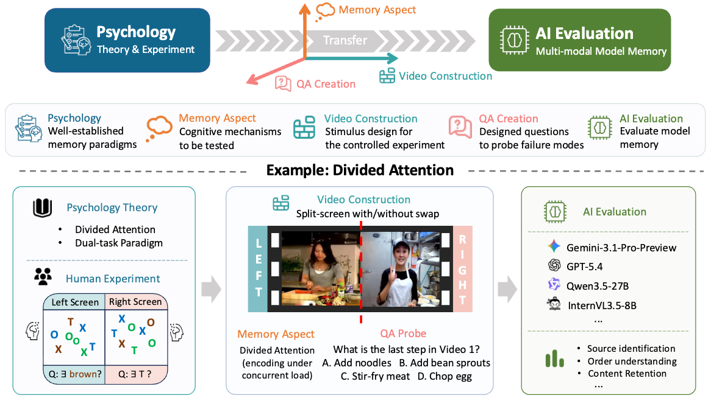
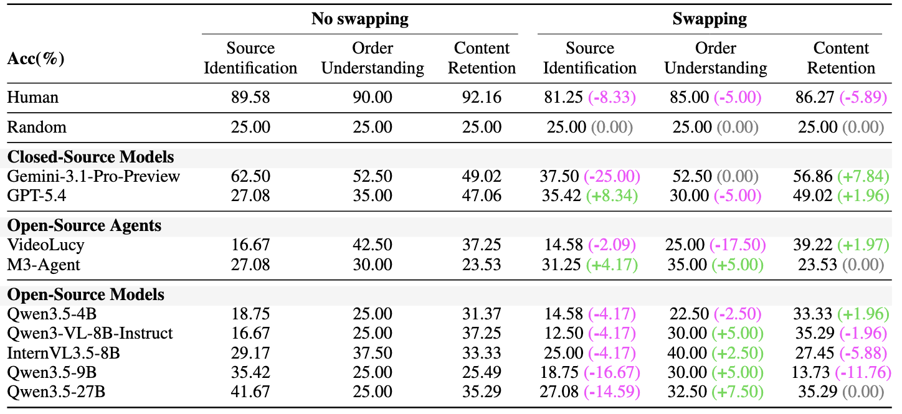
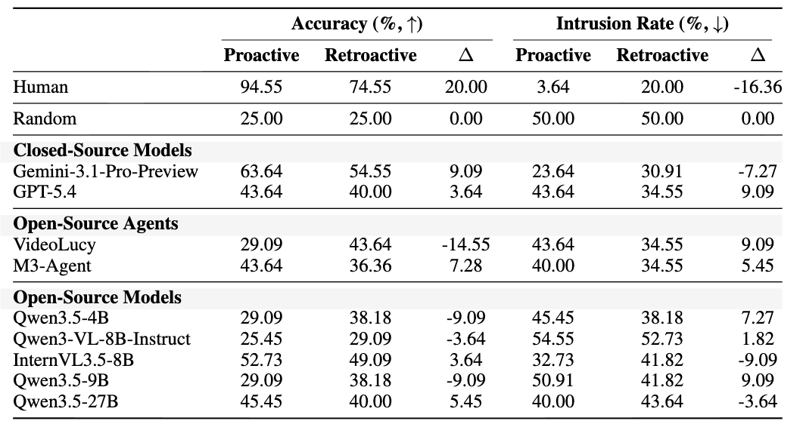
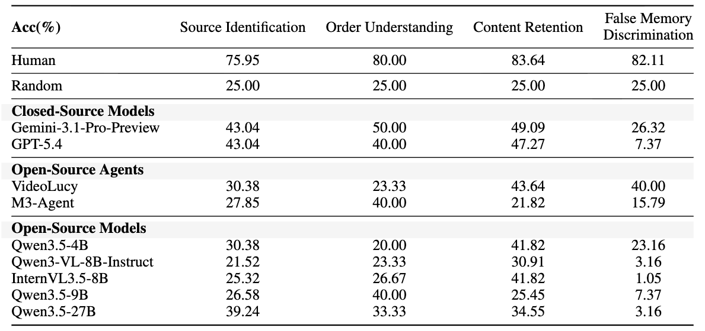
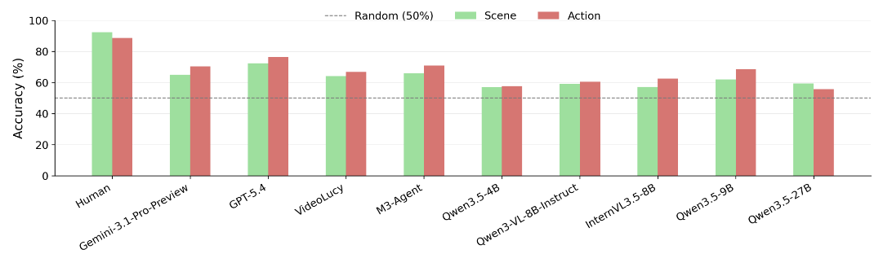
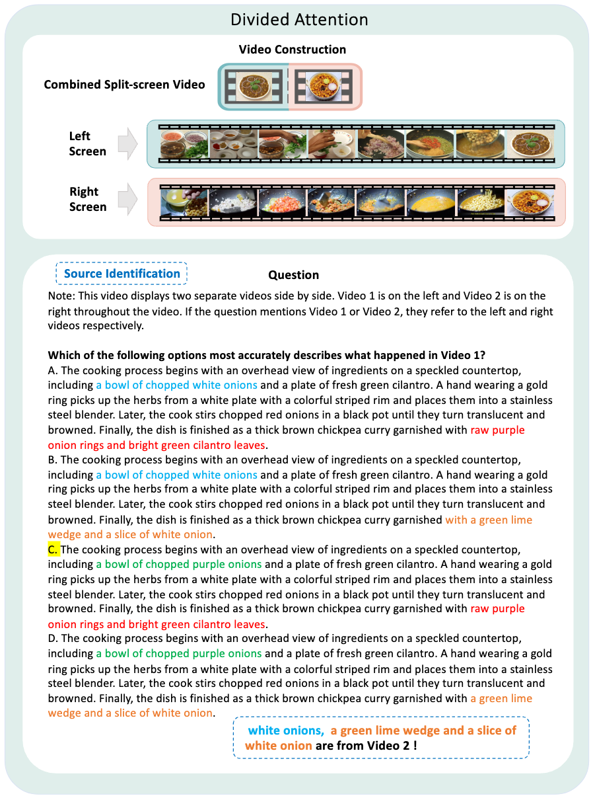
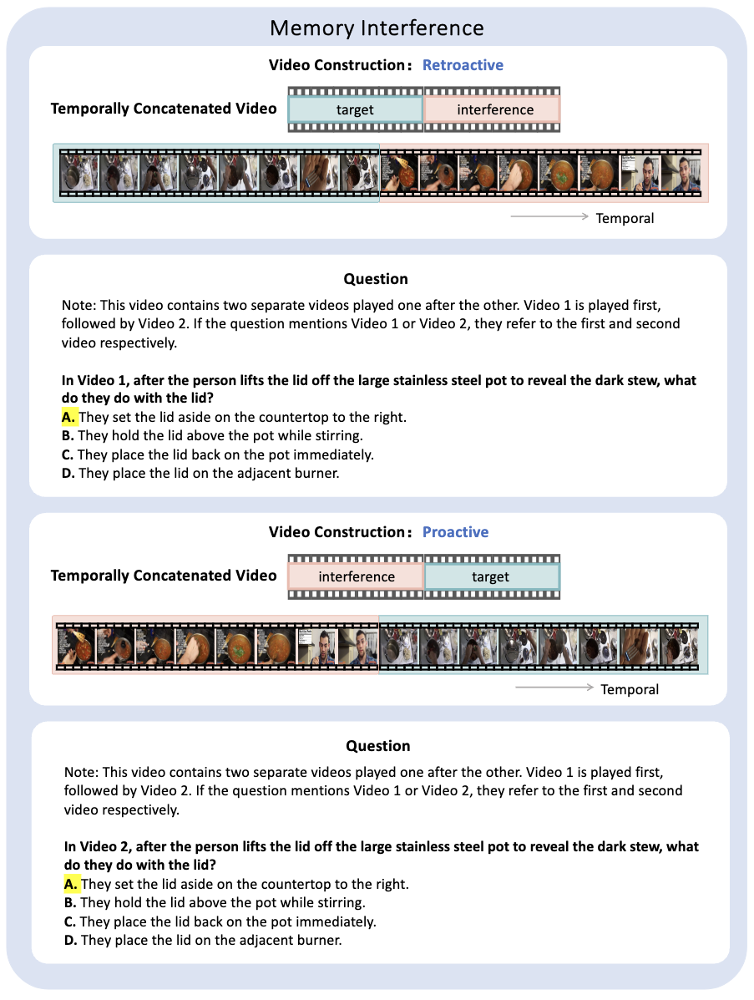
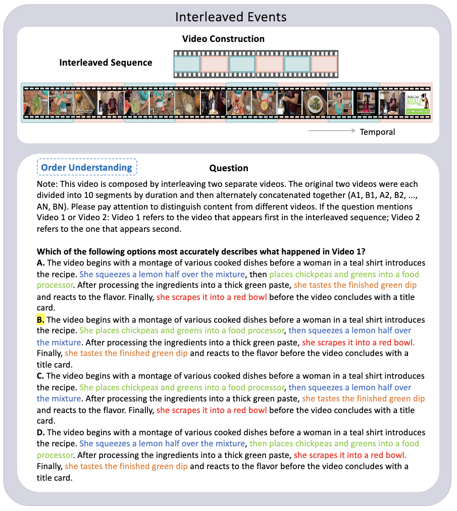
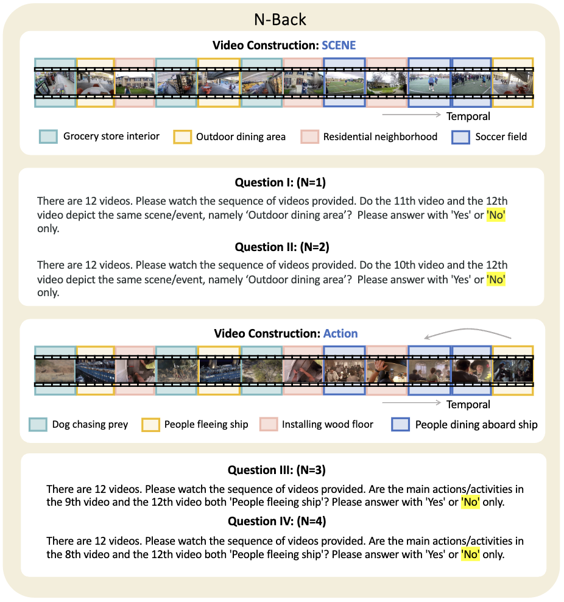

<h1 align="center">M³Eval: Multi-Modal Memory Evaluation through Cognitively-Grounded Video Tasks</h1>

<p align="center">
  <a href="https://arxiv.org/abs/2606.05008"></a>
  <a href="https://pku-value-lab.github.io/m3eval-homepage/"></a>
  <a href="https://huggingface.co/datasets/PKU-VaLuE-Lab/m3eval"></a>
  <a href="https://github.com/PKU-VaLuE-Lab/m3eval"></a>
</p>

<p align="center">
  <a href="https://jie-1203.github.io/">Jie Huang</a><sup>1,*</sup>&emsp;
  <a href="https://liuruixun.github.io/">Ruixun Liu</a><sup>1,*</sup>&emsp;
  <a href="https://github.com/PKU-VaLuE-Lab/m3eval">Sirui Sun</a><sup>1</sup>&emsp;
  <a href="https://yyxxyy574.github.io/xinyiyang.github.io/">Xinyi Yang</a><sup>1</sup>&emsp;
  <a href="https://yinli-vision.github.io/">Yin Li</a><sup>2</sup>&emsp;
  <a href="https://yzhu.io/">Yixin Zhu</a><sup>1</sup>&emsp;
  <a href="https://yiwuzhong.notion.site/homepage">Yiwu Zhong</a><sup>1,†</sup>
</p>

<p align="center">
  <sup>1</sup>Peking University&emsp;
  <sup>2</sup>University of Wisconsin-Madison
</p>

<p align="center">
  * Equal contribution.&emsp;† Corresponding author.
</p>

## News

- **2026-05-21**: We released the M³Eval benchmark, code, and project page.

## M³Eval Overview

<p align="center">
  
</p>

### Abstract

As multi-modal models advance towards long-form video understanding, memory emerges as a critical capability. Despite substantial effort in developing video datasets and benchmarks, existing work primarily focuses on perception and reasoning, without systematically evaluating memory: what models retain, how faithfully information is preserved, and how robust memory remains under interference.

To address this gap, we introduce M³Eval, the first comprehensive evaluation framework and benchmark for probing different memory dimensions in multi-modal models. Grounded in cognitive psychology, our design features carefully constructed tasks isolating key aspects of memory. Leveraging M³Eval, we conduct extensive experiments across representative multi-modal models, revealing consistent weaknesses and distinctive behaviors.

We find that models struggle to maintain disentangled representations when processing parallel video streams, exhibit interference patterns differing substantially from those observed in human memory, ground memory sources more reliably in the spatial domain than the temporal domain, and demonstrate limited symbolic memory. Collectively, our benchmark provides a valuable resource for future research, whereas our findings highlight memory as a fundamental yet underexplored capability and offer insights for designing more effective memory mechanisms in multi-modal models.

## Main Results

### Divided Attention



Accuracy (%) on three divided attention metrics under the split-screen setting without swaps and with frequent left/right swaps.

### Memory Interference



Proactive: first video (V1) interferes with recall of the second video (V2); retroactive: second video (V2) interferes with recall of the first video (V1). Delta denotes proactive minus retroactive.

### Interleaved Events



Accuracy (%) on four interleaved reconstruction metrics.

### N-Back



Average accuracy under two symbolic attributes, scene and action, averaged over all K and N configurations.

## Usage

### Install

```bash
git clone https://github.com/PKU-VaLuE-Lab/m3eval.git
cd m3eval/lmms-eval
uv pip install -e ".[all]"
cd ..
```

### Download the Dataset

The benchmark is composed from existing public benchmarks. Users must follow the original licenses and usage terms of each source dataset.

Download the dataset and unpack it into `data/m3eval/`:

```bash
huggingface-cli download PKU-VaLuE-Lab/m3eval \
  --repo-type dataset \
  --local-dir data/m3eval

bash data/m3eval/unpack_archives.sh
```

After unpacking, `data/m3eval/` should contain:

```text
data/m3eval/
├── qa_root/
├── questions/
├── nback/
├── viewer/
└── videos/
    ├── interleaved/
    ├── memory_interference/
    ├── split_screen/
    └── nback/
```

### Evaluation

The main public entry point is:

```bash
bash lmms-eval/scripts/run_m3eval_vllm.sh \
  --model_path /path/to/your/model \
  --task m3eval \
  --gpus 0 \
  --batch_size 1
```

For multi-GPU data-parallel evaluation, use:

```bash
bash lmms-eval/scripts/run_m3eval_sharded_vllm.sh \
  --model_path /path/to/your/model \
  --task m3eval \
  --gpus 0,1,2,3 \
  --num_processes 4 \
  --batch_size 1
```

For a quick smoke run:

```bash
bash lmms-eval/scripts/run_m3eval_vllm.sh \
  --model_path /path/to/your/model \
  --task m3eval_memory_interference \
  --gpus 0 \
  --limit 1 \
  --max_frame_num 8
```

Useful task names:

- `m3eval`
- `m3eval_memory_interference`
- `m3eval_split_screen`
- `m3eval_interleaved`
- `m3eval_nback`

The script writes outputs to `lmms-eval/output/m3eval/` by default. See [lmms-eval/README_M3EVAL.md](lmms-eval/README_M3EVAL.md) for the dataset layout and task names.

To convert lmms-eval outputs into paper-facing tables, pass `*_results.json` from a full `--task m3eval` run:

```bash
python lmms-eval/scripts/aggregate_m3eval_results.py \
  lmms-eval/output/m3eval/path/to/*_results.json
```

If you aggregate a single subtask result or a smoke run, uncovered fields will appear as `N/A`.

## Dataset Examples

### Divided Attention



Simultaneous memory for two side-by-side videos.

<details>
<summary>Click to expand more examples</summary>

### Memory Interference



Interference between sequentially presented videos.

### Interleaved Events



Memory reconstruction from temporally interleaved clips.

### N-Back



Decide whether the final clip matches the clip N positions earlier.

</details>

## Citation

If you use M³Eval in your work, please cite:

```bibtex
@article{huang2026m3eval,
  title   = {M3Eval: Multi-Modal Memory Evaluation through Cognitively-Grounded Video Tasks},
  author  = {Huang, Jie and Liu, Ruixun and Sun, Sirui and Yang, Xinyi and Li, Yin and Zhu, Yixin and Zhong, Yiwu},
  journal = {arXiv preprint arXiv:2606.05008},
  year    = {2026}
}
```
